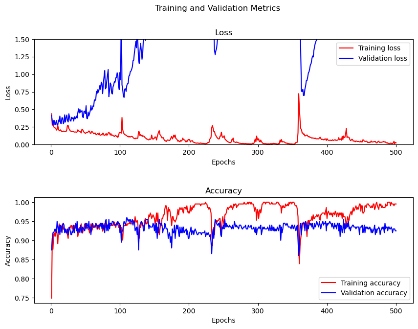
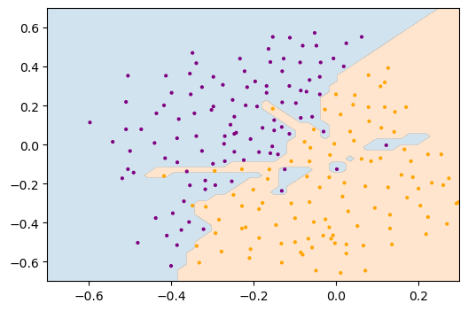
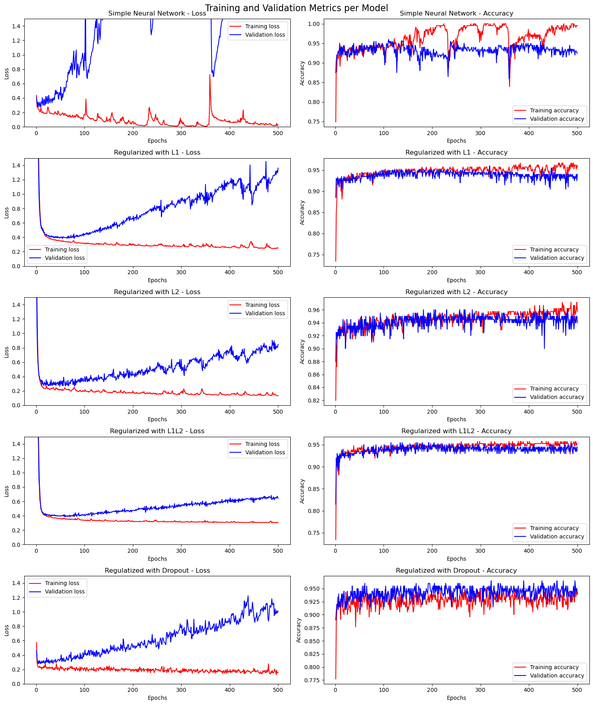
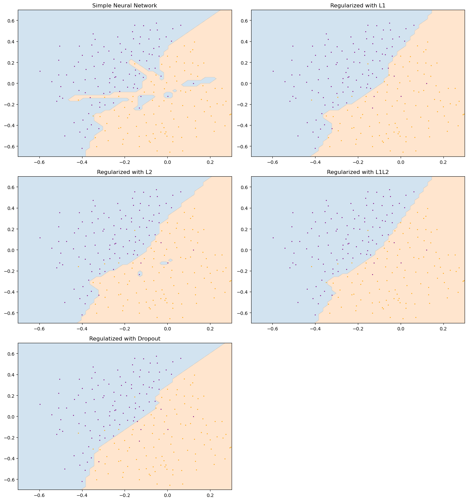

# Regularization Methods For Deep Learning

In this mini-project, I compared four regularization techniques to avoid overfitting in deep neural networks. For this comparison, I've used a simple two-dimensional dataset to classify the instances into two classes. This dataset has 411 instances and is stored as four `.npy` files.

## Neural Network with No Regularization

For this project I used "Keras" with "Tensorflow" backend. The model consists of a four-layered neural network which uses $4000$ neurons and "ReLu" activation function in the middle layers, and one neuron for the output layer with "Sigmoid" activation function.

This amount of neurons for this task is overkill, but ensures that we see overfitting happen in the training process. For training, I used "Adam" optimizer and "Binary Crossentropy" loss function with 500 epochs and batch size of 32.

In the simple model, we can see that after around 100 epochs, the accuracy of training set still improves, but the validation set accuracy remains the same.

Using the `plot_decision_boundaries()` function, we draw a plot of the data points, along with the regions from the model. In our first model, we can see that even outliers have a region of themselves, ensuring the model is memorizing instead of learning.

## Dropout Regularization

In dropout method, we intent to drop some of neurons in each step of updating weights, so we can avoid that some neurons having big weights while other neurons of that layer have small wight values. When a neuron is dropped, a step of optimization will be done on other neurons, which makes them have a more distributed set of weights. This will avoid overfitting.

## L1 and L2 Regularizations

In these methods, we add the values of the weights of out network to the loss function thus in the process of optimizing the weights, it won't assign a very large or small weight and will avoid overfitting.

L1 Regularization or Lasso Regularization adds the absolute sum of weights to the loss function.

$$
\operatorname{new\_loss\_function = loss\_function + \lambda \sum_{i=1}^{k} |w_{i}|}
$$

L2 Regularization or Ridge Regularization adds the sum of the squares of the weights to the loss function.

$$
\operatorname{new\_loss\_function = loss\_function + \lambda \sum_{i=1}^{k} w_{i}^{2}}
$$

And finally the L1L2 regularization combines the both L1 norm and L2 norm and adds them to the loss function.

## Results

The final results of this mini-project is shows as the plots below.

First we can see the plot of the metrics "Accuracy" and "Loss" over epochs for all methods:

And for a more inuitive understanding of how these methods worked, we can see the colored boundaries of the data points in the plot.

